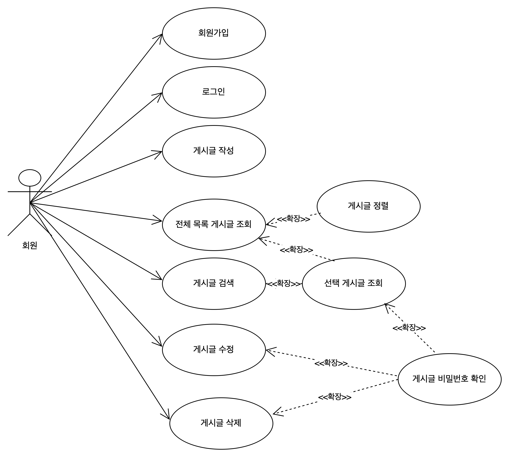
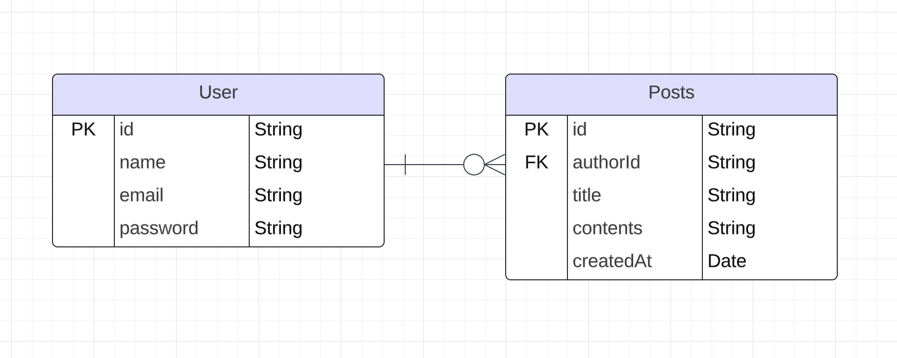

# 항해 사전 spring-study

## 1. Use-Case



- why?

회원이 서비스를 이용하게될 때 직접 경험하는 행동이 무엇인지를 생각하여 연결을 했다.


## 2. 테이블 스키마




(1)

HTTP 프로토콜은 상태를 유지하지 않는다.

로그인 상태를 유지하려면, JWT(액세스토큰)을 사용하여 구현이 필요하다.

1차적으로는 비회원으로도 Posts(게시글)을 작성할 수 있도록 하고, 2차에서는 유저 로그인 기능을 추가해야될거같다.

<br>

(2)

> 왜 id 를 int가 아닌 String으로 했는가?

대용량 데이터를 생각해봤을때 int의 경우에는 데이터 표현 범위가 정해져있기때문이다. int 타입이 표현가능한 범위는 -2,147,483,648 ~ 2,147,483,647  이다.
id로 나타낼수 있는 값의 최대값이 2,147,483,647 이다. 그 이상의 값은 나타내기가 어렵다. int 타입이 아닌 대용량 데이터일 경우에는 어떤 타입을 하게될지 곰곰히 생각해봤다.

<br><br>

- (1) int타입이 아닌 long 타입으로 나타낸다.

long타입은 int타입보다 더 폭넓게 표현할 수 있다. 그러나 long타입도 실제로는 8byte(64bit)지만 표현범위가 제약되어있는걸로 알고있다.
long 타입의 표현범위는9,223,372,036,854,775,808 ~ 9,223,372,036,854,775,807 이다. 만일 id가 (혹은 데이터의전체개수가) 9,223,372,036,854,775,807보다 큰 숫자라면 long 타입도 표현의 한계가있다. 물론 db스케일아웃을 할 수도있지만 그렇게 할 수 없다고 가정하자면 말이다.

<br><br>

- (2) UUID 로 표기한다.

UUID는 128bit 사이즈로 36자리로 long타입보다 더 많이 표현될 수 있다. 물론 숫자가 아니라서 auto_increment가 안되는건 어쩔 수 없다. 그래도 식별자의 역할을 하고 있기도하고
RDBMS 데이터베이스의 테이블설계시 컬럼 사이즈를 정하기때문에 괜찮은거같다. 그렇지만, 128bit사이즈로 표현가능한 범위를 넘는 대용량데이터에서는 한계가 존재한다.

<br>

(참고) 자바에서도 UUID로 나타낼 수 있다.

```java
import java.util.UUID;
UUID.randomUUID().toString();
```

- (참고) [https://docs.tosspayments.com/resources/glossary/uuid](https://docs.tosspayments.com/resources/glossary/uuid)

<br><br>

- (3) 년월일을 기준으로 한다.
 - 시간은 항상 끊임없이 흘러간다.
 - id의 고유성을 가지면서 대용량을 나타낼때,  년도-월-일-시-분-초-ms 단위의 숫자문자열로 표기해야될거같다.
    - javascript의 Date().getTime() 처럼 현재시각에 대한 값을 나타낸다. 이 값은 UTC 1970년1월1일 0시0분0초 부터 현재까지의 경과시간을 나타낸다.
      ```js
      const date = new Date();
      
      console.log(date); // "2024-11-07T09:51:47.863Z"
      console.log(date.getTime()); // 1730973107863
      ```

<br><br
- 결론

- 컬럼 사이즈가 정해져있기도하다. 그래서 int로 해도되고 long으로 해도되고 아니면 uuid로 해도된다. 무한한 데이터를 다룰수 없겠지만 필자의 경우에는 세가지 케이스중에서 **(2)인 uuid로 id를 나타내기로 했다.** 그 이유는 3번의 경우에는 string이 아닌 long으로 표기가 가능하다.

- 꼭 한개의 데이터베이스와 하나의 테이블내에서 해결할 필요는 없다. 물론 금전적인 비용이들겠지만 부족하면 데이터베이스를 스케일아웃을 하면된다. 스케일아웃하게되면 같은 id를 갖는 데이터가 여러개가 되는 문제를 겪게된다.

<br>

## 3. API 명세서

[api-dog 명세서](https://www.apidog.com/apidoc/shared-4d19564a-0cf9-4cc5-8d35-b642dd1eb7a0)
